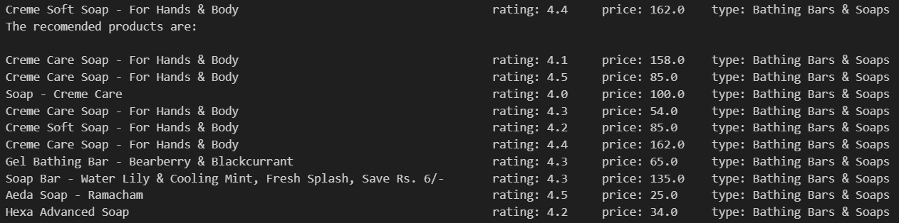

# Product-Recommender-System

This repository contains a content-based recommender system using the [BigBasket Products](https://www.kaggle.com/datasets/surajjha101/bigbasket-entire-product-list-28k-datapoints) dataset.

The notebook file contains EDA, data preprocessing, feature engineering, model training, and testing performed on the dataset. The recommender system is built using a K-nearest neighbor model. A full report on the project can be found in the `Content-based Recommender System.pdf` file.

Recommendation for a sample product:

## License
This project is licensed under the Apache 2.0 License - see the [LICENSE](LICENSE) file for details.
